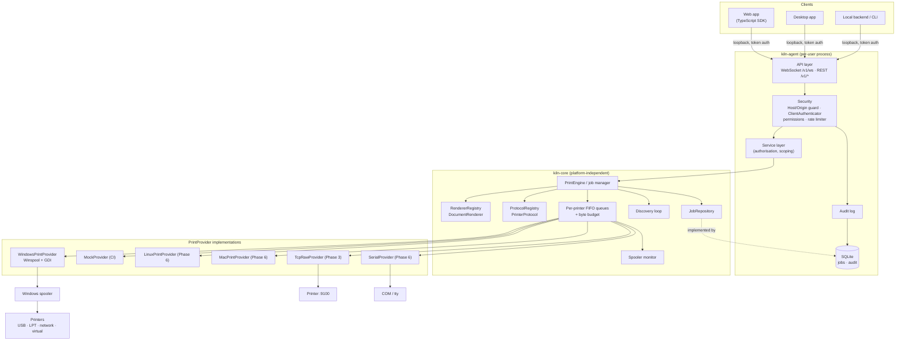
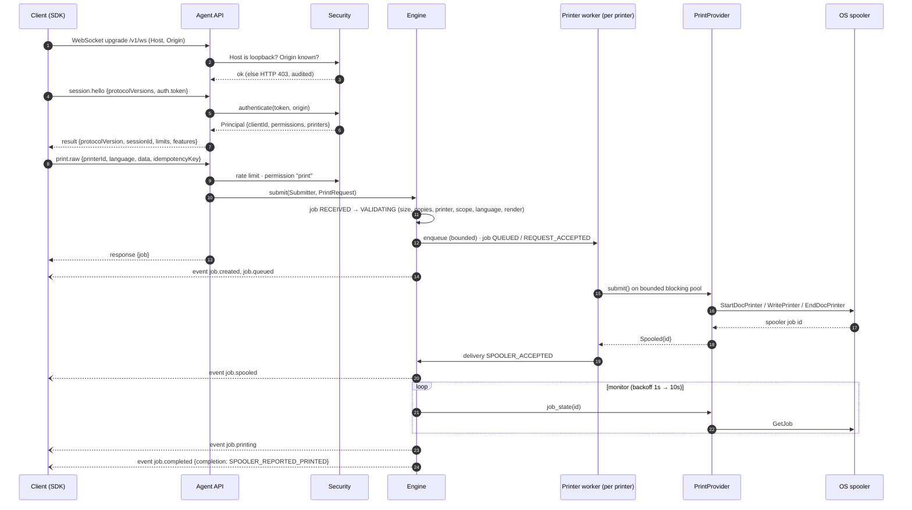

# Architecture

Kiln Print lets web apps, desktop apps and backend services print to printers attached to a user's machine, through a small local **Print Agent**. This document covers components, data flow and extension points. Companion documents:

| Topic | Document |
|---|---|
| Technology choice | [adr/0001-technology-stack.md](adr/0001-technology-stack.md) |
| Why a user-session process | [adr/0002-user-session-agent.md](adr/0002-user-session-agent.md) |
| Retry policy | [adr/0003-no-automatic-print-retries.md](adr/0003-no-automatic-print-retries.md) |
| Wire protocol | [protocol.md](protocol.md) |
| Security and trust model | [security-model.md](security-model.md) |
| Job lifecycle | [print-job-lifecycle.md](print-job-lifecycle.md) |
| Windows implementation | [windows-strategy.md](windows-strategy.md) |
| Scope and phases | [mvp-scope.md](mvp-scope.md) |
| Testing | [testing.md](testing.md) |

## Component diagram



## Crates and folders

| Path | Crate | Responsibility | `unsafe` |
|---|---|---|---|
| `print-core/` | `kiln-core` | Model, error model, extension traits, engine, queues, monitor, discovery | forbidden |
| `protocols/` | `kiln-protocols` | Printer-language descriptors plus read-only inspection (ZPL, EPL, CPCL, TSPL, ESC/POS, ESC/P, RAW) | forbidden |
| `renderers/` | `kiln-renderers` | RAW passthrough, text (RAW-encoded or native layout); PDF/HTML/image in Phase 2 | forbidden |
| `providers/windows/` | `kiln-provider-windows` | Winspool/GDI adapter; the only crate that calls Win32 | allowed, documented per block |
| `providers/mock/` | `kiln-provider-mock` | Scriptable provider for CI and `--mock` development | forbidden |
| `providers/linux/`, `providers/macos/` | — | Placeholders with implementation notes (Phase 6) | — |
| `agent/` | `kiln-agent` | Config, logging, SQLite, security, WebSocket/REST API, CLI | forbidden |
| `sdk/typescript/` | — | TypeScript SDK (Phase 2) | — |
| `dashboard/` | — | Management UI (Phase 5) | — |
| `examples/` | — | Runnable Node examples (ZPL, ESC/P, text, raw file) | — |
| `tests/hardware/` | — | Hardware test procedures and printer setup script | — |

The dependency direction is strict: `agent → core ← providers/renderers/protocols`. Core never depends on a provider, so adding one never touches the engine.

## Communication flow

### Session and print request



Events are pushed only to sessions allowed to see them: a client's own jobs, or all jobs with `jobs.read.all`, and printers within its scope. Events and responses travel over the same socket but are produced by different tasks, so **a job's first events may arrive before the response carrying its `jobId`**. Clients (and the SDK) must buffer or reconcile.

### Threading and backpressure

```text
tokio runtime: 2–4 worker threads (async I/O, API, engine bookkeeping)
blocking pool: ≤ 32 threads, further divided by semaphores:
    provider_permits (4)   submissions, cancellations
    monitor_permits  (4)   status polls, discovery, capabilities, queue listings
    render_permits   (2)   document rendering
per printer: 1 worker task (lazy), FIFO channel of capacity 128
global: byte budget of 512 MiB for payloads held in agent queues
```

- **Order.** Each printer's worker submits strictly one job at a time, in arrival order. A timed-out submission is waited out before the next one starts, so two jobs never interleave on one device.
- **Isolation.** A jammed or slow printer ties up only its own worker, plus at most one provider permit while its submit call is running. Other printers keep flowing, and tests assert this.
- **Backpressure.** A full per-printer queue or an exhausted byte budget returns `QUEUE_FULL` (`recoverable: true`) immediately, instead of growing memory.
- **Limits.** Oversized documents are rejected before decoding (`PAYLOAD_TOO_LARGE`). WebSocket frames and HTTP bodies are capped at the base64 size of the largest allowed document.

## Extension points

| Interface | Crate | Add one to… | Engine changes needed |
|---|---|---|---|
| `PrintProvider` (+ `PrinterDiscoveryProvider`) | core | support an OS or transport (CUPS, macOS, raw TCP 9100, serial, IPP) | none: register with `EngineBuilder::provider` |
| `PrinterDiscoveryProvider` | core | find printers another provider drives (mDNS/IPP browse, configured TCP printers) | none |
| `DocumentRenderer` | core | support a document type (PDF, HTML, image) | none: `EngineBuilder::renderer` |
| `PrinterProtocol` | core | add a printer command language (DPL, IPL, SBPL, …) | none: `EngineBuilder::protocol` |
| `JobRepository` | core | change storage (the SQLite implementation is in `agent/src/persistence.rs`) | none |
| `ClientAuthenticator` | agent | change how clients prove identity (pairing, signed requests, OS-level IPC auth) | none: the API depends on the trait |

A renderer declares the payload kinds it can produce (`output_kinds`), and a provider declares what it accepts per printer (`supports`). The engine only offers a document type for a printer when the two overlap. That is how `TEXT` stays available on RAW-only label printers (via RAW text mode), while RAW is refused on v4 drivers.

## Data model summary

- **Printer**: `id` (stable, derived from provider and native name), `name`, `type` (`LOCAL | NETWORK | USB | SERIAL | VIRTUAL`), driver, port, `default`, `online`, `status`, `conditions[]`, and `capabilities` (every field optional; unknown ≠ false).
- **Job**: see [print-job-lifecycle.md](print-job-lifecycle.md). The key design point is that `status` and `delivery` are separate fields, so "the agent accepted it" is never confused with "the spooler has it" or "it printed."
- **PrintError**: `errorCode`, `message`, `jobId`, `printerId`, `recoverable`, `details`. It never contains stack traces or paths. Unexpected failures become `INTERNAL_ERROR` with a generic message, and the detail goes to the log.
