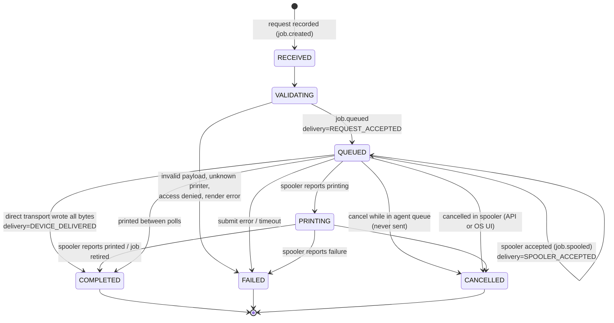

# Print-job lifecycle

Every print request creates a job, including requests that fail validation. A job is never reported `COMPLETED` just because the agent accepted it.

## Two dimensions: `status` and `delivery`

| Field | Values | Answers |
|---|---|---|
| `status` | `RECEIVED` → `VALIDATING` → `QUEUED` → `PRINTING` → `COMPLETED` / `FAILED` / `CANCELLED` | Where is the job in its lifecycle? |
| `delivery` | `REQUEST_ACCEPTED` → `SUBMITTING` → `SPOOLER_ACCEPTED` or `DEVICE_DELIVERED` | How far have the bytes travelled? |
| `completion` | `SPOOLER_REPORTED_PRINTED`, `SPOOLER_JOB_RETIRED`, `BYTES_DELIVERED` | Why do we believe it completed? |
| `condition` | e.g. `PAPER_OUT`, `PRINTER_OFFLINE`, `SPOOLER_ERROR`, `PRINTER_BUSY` | What is holding it right now (not a failure) |

`QUEUED` + `REQUEST_ACCEPTED` means waiting in the agent's queue, and nothing has been sent. `QUEUED` + `SPOOLER_ACCEPTED` means the OS spooler owns the complete job and it is waiting its turn. That split is the distinction between **REQUEST_ACCEPTED** and **SPOOLER_ACCEPTED**.

Transitions are enforced in `JobStatus::can_transition_to`. Terminal states are final, and the engine refuses any mutation after a job becomes terminal.

## Timestamps

`createdAt` (received), `queuedAt`, `submittedAt` (spooler or device accepted), `startedAt` (printing first observed), `completedAt` (any terminal state), `updatedAt`.

## What "COMPLETED" means, and its limits

| `completion` | Set when | Confidence |
|---|---|---|
| `SPOOLER_REPORTED_PRINTED` | The Windows spooler set `JOB_STATUS_PRINTED` or `JOB_STATUS_COMPLETE` | The spooler sent every byte to the port. Physical output is likely but not confirmed. |
| `SPOOLER_JOB_RETIRED` | The job left the queue without an error or deletion being seen | Weaker. Windows deletes finished jobs within moments, often between two polls. A user deleting the job in the Windows queue UI between polls also looks like this (Phase 2 change notifications will tell them apart). |
| `BYTES_DELIVERED` | A direct transport (TCP 9100, serial; Phase 3/6) wrote all bytes and flushed | The device's buffer has the data. Nothing more. |

**Physical completion is generally unknowable through the OS:**

- Most drivers report "printed" when the port monitor has written the data, not when paper leaves the printer.
- USB printers on Windows rarely report offline, paper-out or jam back to the spooler. The job shows as printed while the device is out of labels.
- RAW jobs bypass the driver entirely, so bidirectional status is whatever the port monitor reports.
- Network printers via Standard TCP/IP ports report completion when the socket drains, unless SNMP status is enabled on the port.
- Virtual printers (PDF/XPS/OneNote) "complete" when their file is written.

Where a printer language supports status queries (Zebra `~HS`, ESC/POS `DLE EOT`), Phase 3 can add opt-in device-confirmed completion for direct transports. It would appear as a new `completion` value.

## Blocking conditions

When the spooler reports paper out, offline, a paused job or a driver error on a job, the job stays `QUEUED` or `PRINTING` with `condition` set, and a `job.updated` event is sent. The spooler holds the job and resumes when the condition clears. The agent does not fail it, and does not retry it.

## Cancellation

| Where the job is | Effect of `jobs.cancel` |
|---|---|
| `RECEIVED` / `VALIDATING` / `QUEUED` with `REQUEST_ACCEPTED` | Removed from the agent queue. Nothing was sent. → `CANCELLED` |
| `SUBMITTING` | Refused with `INVALID_JOB_STATE` (`recoverable: true`). Retry in a moment. |
| `SPOOLER_ACCEPTED` | Deleted in the spooler (`SetJob(JOB_CONTROL_DELETE)`) → `CANCELLED`, with a warning that data already sent to the printer may still print |
| Terminal / `DEVICE_DELIVERED` | `INVALID_JOB_STATE` |

A job deleted from the OS queue by the user or an administrator is reported as `CANCELLED` if the deletion is observed. A cancellation the agent itself requested is never mistaken for a completion (an engine-level guard covers the race between the deletion and the next poll).

## Failure outcomes

A `FAILED` job's `error.details.outcome` tells the client whether it may resubmit:

| `outcome` | Meaning | `recoverable` |
|---|---|---|
| `NOT_PRINTED` | Never handed to the spooler or device (for example, the agent restarted while the job waited in its queue) | `true` |
| `UNKNOWN` | Handover may have happened (submission timeout, crash during `SUBMITTING`, printer removed while spooled) | `false` |
| absent | Validation or pre-submission errors: nothing was sent | per error code |

See [ADR 0003](adr/0003-no-automatic-print-retries.md): the engine never retries, and clients use `idempotencyKey` to resubmit safely.

## Agent restart and shutdown

Payloads are held in memory only and never written to disk. On restart, `reconcile_after_restart` settles every non-terminal job from SQLite:

| Persisted state | Reconciled to |
|---|---|
| `REQUEST_ACCEPTED` | `FAILED`, `outcome: NOT_PRINTED`, recoverable |
| `SUBMITTING` | `FAILED`, `outcome: UNKNOWN`, not recoverable |
| `SPOOLER_ACCEPTED` and the printer still exists | monitoring resumes. The spooler still has the job (or it finished while the agent was down). |
| `SPOOLER_ACCEPTED` and the printer is gone | `FAILED`, `PRINTER_NOT_FOUND`, `outcome: UNKNOWN` |

On graceful shutdown, jobs still in agent queues are failed immediately (`NOT_PRINTED`), and in-flight submissions get up to 10 s to finish.

## Retention

Terminal jobs older than `jobs.retention_days` (default 30) are purged hourly. Active jobs are never purged. Job rows store metadata only.
