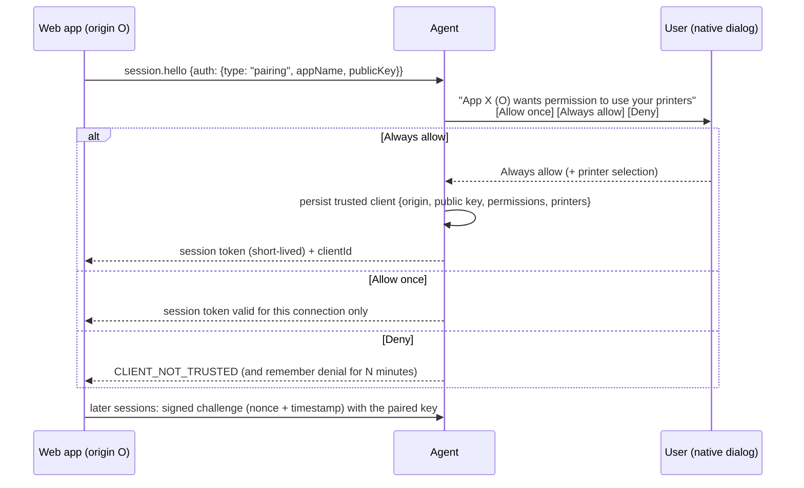

# Security and trust model

The agent turns HTTP requests into physical output on hardware the user owns, and any website the user visits can try to reach `localhost`. The central rule:

> **No unauthenticated request can print, and no website can use the agent unless the user has explicitly trusted that website.**

## Threat model

| Adversary | Capability | Controls |
|---|---|---|
| Arbitrary website in the user's browser | Can open `ws://localhost`, send `fetch`/form posts, rebind DNS to 127.0.0.1 | Origin must be registered for a client *before* the upgrade (unknown origin → 403). `Host` must be a loopback name (defeats DNS rebinding). The token is bound to its registered origins. No CORS on REST. The admin token is refused from any browser origin by default. |
| Trusted website that is compromised (XSS) | Uses that site's legitimate token | Per-client permissions and printer allow-list. Rate limiting. Audit log. Revocation (Phase 4). |
| Other devices on the network | TCP to the machine | Loopback bind by default. Non-loopback peers are rejected. Binding elsewhere needs `allow_non_loopback = true` (and TLS in Phase 4). |
| Other local processes as the same user | Same privileges as the user | Out of scope for isolation: they can already read the user's files, including the admin token. Controls here are auditability and least-privilege tokens for applications. |
| Other local users (multi-user machine) | Can connect to loopback ports | Token required. The token file lives in the per-user profile (ACL-protected). Per-session ports in Phase 6. |
| Hostile document content | HTML with scripts, remote resources or `file:` references; images built as decompression bombs; malformed PDFs | HTML renders in a throw-away headless browser with JavaScript off, every network request failed (dead proxy plus `Fetch` interception, loopback included), injected into `about:blank` (no `file:` access), killed on timeout. Images: pixel and allocation caps before decoding. PDFs are parsed by the OS engine in the agent's user context. See [ADR 0004](adr/0004-document-rendering.md). |
| A client using the agent to reach arbitrary network hosts | direct TCP printing | Only `[[network_printers]]` configured by an administrator exist. No API accepts a host or port, and a request naming `tcp://…` is simply "printer not found". Client printer scopes apply. |
| Client text injecting printer commands | Label/receipt text containing `^XZ`, `~JR`, quotes, control codes | Per-language escaping (ZPL `^FH` hex escapes, EPL/TSPL quote escapes, control characters flattened); golden tests assert that `^XZ` inside text prints literally. `RAW` elements are the explicit, documented escape hatch. |
| A client using the agent to read files or reach internal URLs | `path`/`url` document sources | Disabled unless an administrator lists allowed folders / URL prefixes (prefixes must end with `/`). Paths are canonicalised before the check. The same error is returned for "missing" and "outside" (no existence oracle). No redirects. Size caps. The `print` permission is checked before any read or fetch. |
| Malformed or hostile payloads | Oversized or garbled input | Size caps before decoding. Frame and body caps. Strict JSON schemas. Bounded queues. Memory-safe parsing (`unsafe` is forbidden outside the Windows FFI crate). |
| Log and database readers | Read agent storage | Payloads and tokens are never logged or stored. Only token hashes are kept in configuration. Job names are not logged. |

## Phase 1 trust model (implemented)

1. **Local administrator token.** Created on first start: 256 bits from the OS CSPRNG, stored in `<data dir>/admin.token`, which inherits the user profile's ACL on Windows and gets mode 0600 on Unix. It carries every permission. It is meant for native tools, scripts and the future dashboard, and it is rejected from browser origins unless `security.admin_origins` lists them.
2. **Registered clients.** `kiln-agent new-client --id lab --name "Lab App" --origin https://lab.example.com` generates a token, prints it once, and prints a config entry that stores only its SHA-256. Each client has:
   - `origins`: the only browser origins it may connect from. A native client sends no `Origin`.
   - `permissions`: `printers.read`, `print`, `jobs.read`, `jobs.read.all`, `jobs.cancel`, `jobs.cancel.all`, `queue.read`, `clients.read`.
   - `printers`: an allow-list of printer ids or names, or `*`.
3. **Request pipeline.** Every request passes these checks in order:
   1. The peer address is loopback.
   2. The `Host` header is `localhost`, `127.0.0.1` or `[::1]` (with any port).
   3. `Origin`, if present, is a plain http(s) origin (`null`, `file:` and extension origins are refused) that some client has registered.
   4. Authentication: WebSocket `session.hello` within 10 s, or a REST bearer token. Tokens are compared as SHA-256 digests in constant time, across all entries.
   5. The origin is bound to the authenticated client.
   6. Per-client token-bucket rate limiting, plus a per-connection in-flight cap.
   7. Per-method permission checks.
   8. Printer-scope checks. Objects outside the client's scope are reported as not found.
4. **Silent printing.** Once authenticated, a client with `print` prints without any OS dialog. Silent printing is never unauthenticated printing: it is always the authenticated identity plus that identity's granted scope.
5. **Replay protection.** Request ids are unique per session. `idempotencyKey` makes resubmission safe across sessions. TLS (Phase 4) protects tokens in transit. On loopback without TLS, the exposure is limited to local processes, which already have the user's rights.
6. **Audit log** (SQLite `audit_log`, plus the `kiln::audit` log target): agent start/stop, connections rejected by guard or origin, authentication failures, client connect/disconnect. Retention defaults to 90 days. The log is readable via `GET /v1/audit` by the local administrator only.

## Phase 4 target: interactive trust

- Trusted clients move from `agent.toml` into SQLite (`trusted_clients`, `client_permissions`). The dashboard can list them, change their scope and revoke them. Revocation closes live sessions immediately.
- Authentication becomes challenge–response: the agent sends a nonce, the client signs `nonce ‖ timestamp ‖ origin` with its key, and the agent rejects stale timestamps and reused nonces (replay protection). Browsers keep the key non-extractable in WebCrypto/IndexedDB. Backends keep it in their secret store.
- TLS: the installer creates a per-machine localhost CA, trusts it in the user's certificate store, and issues a short-lived `localhost` certificate. The agent listens on `wss://localhost:18731`. Plain `ws://` stays loopback-only and can be disabled.
- The same `ClientAuthenticator` trait is used, so the API layer does not change.

## Hardening checklist

| Requirement | Status |
|---|---|
| TLS for localhost | Phase 4 (listener, certificate management) |
| Client authentication | ✅ tokens (Phase 1); pairing and signed challenges in Phase 4 |
| Application identity | ✅ `clientId` on every job and audit record |
| Signed requests / short-lived tokens | Phase 4 |
| Origin validation | ✅ pre-upgrade and per-client binding |
| DNS-rebinding defence | ✅ `Host` validation |
| Permission management | ✅ per-client permissions (static config); UI in Phase 5 |
| Printer-level permissions | ✅ printer allow-list per client |
| Payload size limits | ✅ decode-time, frame and body caps |
| Rate limiting | ✅ per client, plus in-flight cap per connection, plus connection cap |
| Request validation | ✅ strict schemas, bounded ids, sanitised job names |
| Audit logging | ✅ SQLite plus structured log |
| Replay protection | ✅ per-session request ids and idempotency keys; nonce signing in Phase 4 |
| No remote access by default | ✅ loopback bind; config validation refuses otherwise |
| No stack traces to clients | ✅ `INTERNAL_ERROR` is generic; detail goes to the log |
| No payloads in logs | ✅ verified in the Phase 1 test run (log grep) |
| HTML cannot reach the network or loopback | ✅ `renderers/tests/html.rs` asserts zero connections to a local listener; a control run without the sandbox flags does connect |
| HTML JavaScript disabled by default | ✅ `html.javascript = false` |
| File/URL sources disabled by default | ✅ `sources.allowed_paths` and `sources.allowed_url_prefixes` are empty; tested for traversal, prefix spoofing, redirects and missing-vs-outside parity |
